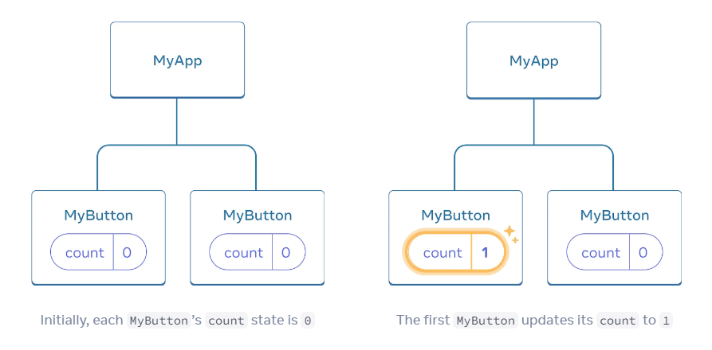
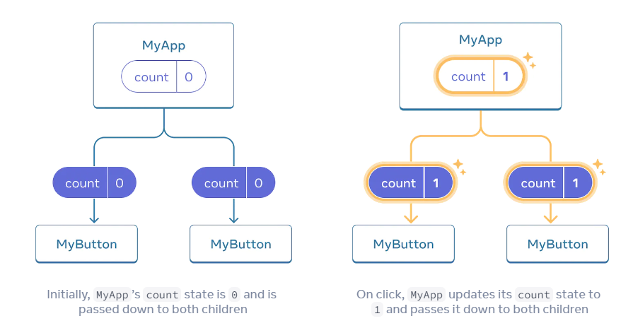

# 快速开始

欢迎来到React文档！此页面将为您介绍您每天将使用的80％的React概念。

您会学到

- 如何创建和嵌套组件
- 如何添加标记和样式
- 如何显示数据
- 如何呈现条件和列表
- 如何响应事件和更新屏幕
- 如何在组件之间共享数据

## 创建和嵌套组件

React应用程序是由组件组成的。组件是具有其逻辑和外观的UI（用户界面）的一部分。组件可以是按钮，也可以是整个页面。

React 组件是返回标记的 JavaScript 函数：

```jsx
function MyButton() {
  return (
    <button>I'm a button</button>
  );
}
```

现在您已经声明 Mybutton，可以将其嵌套到另一个组件中：

```jsx
export default function MyApp() {
  return (
    <div>
      <h1>Welcome to my app</h1>
      {/* highlight-start */}
      <MyButton />
      {/* highlight-end */}
    </div>
  );
}
```

请注意，`<Mybutton />`从大写字母开始。这就是您知道这是一个 React 组件。React 组件名称必须始终以大写字母开头，而HTML标签必须是小写。
查看结果：

```jsx live
function MyApp() {
  
  // 内部组件
  function MyButton() {
    return (
      <button onClick={() => alert("you clicked")}>
        I'm a button
      </button>
    );
  }
  
  return (
    <div>
      <h1>Welcome to my app</h1>
      <MyButton />
    </div>
  );
}
```

`export default` 关键字将指定文件中的主组件。如果你不熟悉一些 JavaScript 语法，[MDN](https://developer.mozilla.org/en-US/docs/web/javascript/reference/statements/export) 和[javascript.info](https://javascript.info/import-export) 有很好的参考。

## 使用JSX编写标记

您在上面看到的标记语法称为 JSX。它是可选的，但大多数 React 项目为了方便起见都使用 JSX。我们为本地开发推荐的所有工具都支持开箱即用的 JSX。

JSX 比 HTML 更严格。您必须关闭像 `<br />` 这样的标签。你的组件也不能返回多个 JSX 标签。您必须将它们包装到共享的父级中，例如 `<div>...</div>` 或空的 `<>...</>` 包装器：

```jsx
function AboutPage() {
  return (
    {/* highlight-start */}
    <>
    {/* highlight-end */}
      <h1>About</h1>
      <p>Hello there.<br />How do you do?</p>
    {/* highlight-start */}
    </>
    {/* highlight-end */}
  );
}
```

如果你有很多 HTML 要移植到 JSX，你可以使用[在线转换器](https://transform.tools/html-to-jsx)。

## 添加样式

在 React 中，您使用 className 指定一个 CSS 类。它的工作方式与 HTML 类属性相同：

```jsx

```

然后在单独的 CSS 文件中为其编写 CSS 规则：

```css
/* In your CSS */
.avatar {
  border-radius: 50%;
}
```

React 没有规定你如何添加 CSS 文件。在最简单的情况下，您将向 HTML 添加一个 `<link>` 标记。如果您使用构建工具或框架，请查阅其文档以了解如何将 CSS 文件添加到您的项目中。

## 数据展示

JSX 允许您将标记放入 JavaScript。花括号让你“逃回”到 JavaScript 中，这样你就可以从代码中嵌入一些变量并将其显示给用户。例如，这将显示 user.name：

```jsx
function showName() {
  const user = {
    name: "react"
  }
  return (
    <h1>
      {/* highlight-start */}
      {user.name}
      {/* highlight-end */}
    </h1>
  );}
```

你也可以从 JSX 属性“转义到 JavaScript”，但你必须使用花括号而不是引号。例如，`className="avatar"` 将 "avatar" 字符串作为 CSS 类传递，但 `src={user.imageUrl}` 读取 JavaScript `user.imageUrl` 变量值，然后将该值作为 `src` 属性传递：

```jsx
function showName() {
  const user = {
    name: "react",
    imageUrl: 'xxx'
  }
  return (
    
  );
}
```

您也可以在 JSX 大括号内放置更复杂的表达式，例如，字符串连接：

```jsx
const user = {
  name: 'Hedy Lamarr',
  imageUrl: 'https://i.imgur.com/yXOvdOSs.jpg',
  imageSize: 90,
};

export default function Profile() {
  return (
    <>
      <h1>{user.name}</h1>
      
    </>
  );
}
```

在上面的示例中，`style={{}}` 不是特殊语法，而是 `style={ }` JSX 大括号内的常规 `{}` 对象。当您的样式依赖于 JavaScript 变量时，您可以使用 `style` 属性。

## 条件渲染

在 React 中，没有用于编写条件的特殊语法。相反，您将使用与编写常规 JavaScript 代码时相同的技术。例如，您可以使用 if 语句有条件地包含 JSX：

```jsx
let content;
if (isLoggedIn) {
  content = <AdminPanel />;
} else {
  content = <LoginForm />;
}
return (
  <div>
    {content}
  </div>
);
```

如果你喜欢更紧凑的代码，你可以使用 `conditional ? operator`。与 if 不同，它在 JSX 内部工作：

```jsx
<div>
  {isLoggedIn ? (
    <AdminPanel />
  ) : (
    <LoginForm />
  )}
</div>
```

当你不需要 else 分支时，你也可以使用更短的逻辑 && 语法：

```jsx
<div>
  {isLoggedIn && <AdminPanel />}
</div>
```

所有这些方法也适用于有条件地指定属性。如果您不熟悉这种 JavaScript 语法的某些部分，您可以从始终使用 `if...else` 开始。

## 列表渲染

您将依赖 JavaScript 功能，例如 `for` 循环和数组 `map()` 函数来呈现组件列表。 例如，假设您有一系列产品：

```jsx
const products = [
  { title: 'Cabbage', id: 1 },
  { title: 'Garlic', id: 2 },
  { title: 'Apple', id: 3 },
];
```

在您的组件中，使用 map() 函数将产品数组转换为 `<li>` 项目数组：

```jsx
const listItems = products.map(product =>
  <li key={product.id}>
    {product.title}
  </li>
);

return (
  <ul>{listItems}</ul>
);
```

注意 `<li>` 有一个 `key` 属性。对于列表中的每个项目，您应该传递一个字符串或数字，以在其兄弟项中唯一标识该项目。通常，键应该来自您的数据，例如数据库 ID。如果您稍后插入、删除或重新排序项目，React 使用您的 key 来了解发生了什么。

```jsx live

function ShoppingList() {
  const products = [
    { title: 'Cabbage', isFruit: false, id: 1 },
    { title: 'Garlic', isFruit: false, id: 2 },
    { title: 'Apple', isFruit: true, id: 3 },
  ];
  const listItems = products.map(product =>
    <li
      key={product.id}
      style={{
        color: product.isFruit ? 'magenta' : 'darkgreen'
      }}
    >
      {product.title}
    </li>
  );

  return (
    <ul>{listItems}</ul>
  );
}
```

## 事件响应

您可以通过在组件内声明事件处理函数来响应事件：

```jsx
function MyButton() {
  {/* highlight-start */}
  function handleClick() {
    alert('You clicked me!');
  }
  {/* highlight-end */}

  return (
    {/* highlight-start */}
    <button onClick={handleClick}>
    {/* highlight-end */}
      Click me
    </button>
  );
}
```

注意 `onClick={handleClick}` 最后没有括号！不要调用事件处理函数：你只需要将它传递下去。当用户单击按钮时，React 将调用您的事件处理程序。

## 更新画面

通常，您会希望您的组件“记住”一些信息并显示它。例如，您可能想要计算单击按钮的次数。为此，请将状态添加到您的组件。

首先，从 `React` 导入 `useState`：

```jsx
import { useState } from 'react';
```

现在你可以在你的组件中声明一个状态变量：

```jsx
function MyButton() {
  const [count, setCount] = useState(0);
  // ...
}
```

您将从 `useState` 获得两件事：当前状态 (`count`) 和允许您更新它的函数 (`setCount`)。你可以给它们起任何名字，但惯例是写 `[something, setSomething]`。 第一次显示按钮时，计数将为 0，因为您将 0 传递给了 `useState()`。当你想改变状态时，调用 `setCount()` 并将新值传递给它。单击此按钮将增加计数器：

```jsx
function MyButton() {
  const [count, setCount] = useState(0);

  function handleClick() {
    {/* highlight-start */}
    setCount(count + 1);
    {/* highlight-end */}
  }

  return (
    <button onClick={handleClick}>
      Clicked {count} times
    </button>
  );
}
```

React 会再次调用你的组件函数。这次，计数将为 1。然后为 2。依此类推。 如果多次渲染同一个组件，每个组件都会获得自己的状态。分别点击每个按钮：

```jsx live
// import { useState } from 'react';
function MyApp() {

  function MyButton() {
    const [count, setCount] = useState(0);
  
    function handleClick() {
      setCount(count + 1);
    }
  
    return (
      <button onClick={handleClick}>
        Clicked {count} times
      </button>
    );
  }
  
  return (
    <div>
      <h1>Counters that update separately</h1>
      <MyButton />
      <MyButton />
    </div>
  );
}
```

注意每个按钮如何“记住”它自己的 `count` 状态并且不影响其他按钮。

## 使用 Hooks

以 `use` 开头的函数称为 Hooks。 `useState` 是 React 提供的内置 Hook。您可以在 [API](https://react.dev/reference/react) 中找到其他内置 Hook。您还可以通过组合现有的 Hooks 来编写自己的 Hooks。 钩子比其他功能更具限制性。您只能在组件（或其他 Hooks）的顶部调用 Hooks。如果您想在条件或循环中使用 `useState`，请提取一个新组件并将其放在那里。

## 在组件之间共享数据



但是，您通常需要组件来共享数据并始终一起更新。 要使两个 MyButton 组件显示相同的计数并一起更新，您需要将状态从单个按钮“向上”移动到包含所有按钮的最近的组件。 在此示例中，它是 MyApp：



现在，当您单击任一按钮时，MyApp 中的计数将发生变化，这将更改 MyButton 中的两个计数。以下是您如何在代码中表达这一点。

首先，将状态从 MyButton 上移到 MyApp：

```jsx
export default function MyApp() {

  {/* highlight-start */}
  const [count, setCount] = useState(0);

  function handleClick() {
    setCount(count + 1);
  }
  {/* highlight-end */}

  return (
    <div>
      <h1>Counters that update separately</h1>
      <MyButton />
      <MyButton />
    </div>
  );
}

function MyButton() {
  {/* highlight-start */}
  // ... we're moving code from here ...
  {/* highlight-end */}
}
```

然后，将状态从 `MyApp` 向下传递到每个 `MyButton`，连同共享的点击处理程序。您可以使用 JSX 花括号将信息传递给 `MyButton`，就像您之前使用 `` 等内置标签所做的那样：

```jsx

export default function MyApp() {
  const [count, setCount] = useState(0);

  function handleClick() {
    setCount(count + 1);
  }

  return (
    <div>
      <h1>Counters that update together</h1>
      {/* highlight-start */}
      <MyButton count={count} onClick={handleClick} />
      <MyButton count={count} onClick={handleClick} />
      {/* highlight-end */}
    </div>
  );
}
```

你像这样传递下来的信息叫做道具。现在 `MyApp` 组件包含计数状态和 `handleClick` 事件处理程序，并将它们作为道具传递给每个按钮。 最后，更改 `MyButton` 以读取您从其父组件传递的道具：

```jsx
{/* highlight-start */}
function MyButton({ count, onClick }) {
{/* highlight-end */}
  return (
    {/* highlight-start */}
    <button onClick={onClick}>
    {/* highlight-end */}
    </div>
      Clicked {count} times
    </button>
  );
}
```

单击按钮时，将触发 `onClick` 处理程序。每个按钮的 `onClick` 属性都设置为 `MyApp` 中的 `handleClick` 函数，所以它里面的代码会运行。该代码调用 `setCount(count + 1)`，递增计数状态变量。新的计数值作为 `prop` 传递给每个按钮，因此它们都显示新值。这被称为“提升状态”。通过向上移动状态，您已经在组件之间共享它。

```jsx live
// import { useState } from 'react';

function MyApp() {
  const [count, setCount] = useState(0);

  function handleClick() {
    setCount(count + 1);
  }

  function MyButton({ count, onClick }) {
    return (
      <button onClick={onClick}>
        Clicked {count} times
      </button>
    );
  }
  return (
    <div>
      <h1>Counters that update together</h1>
      <MyButton count={count} onClick={handleClick} />
      <MyButton count={count} onClick={handleClick} />
    </div>
  );
}
```

## Next Steps

到目前为止，您已经了解了如何编写 React 代码的基础知识！

查看教程，将它们付诸实践，并使用 React 构建您的第一个迷你应用程序。
